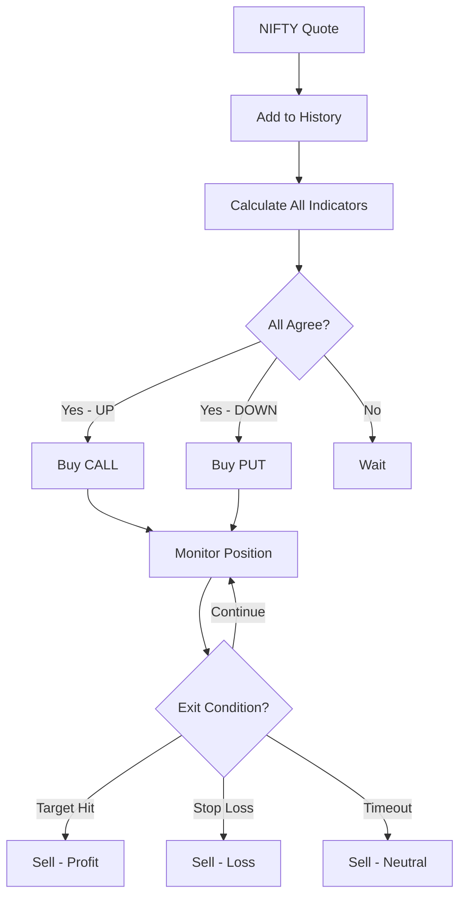

# Rule-Based Trading Strategy

## Overview

The **RuleBasedStrategy** executes trades when multiple technical indicators agree on market direction. Unlike traditional strategies that use a single indicator, rule-based strategies combine multiple signals to increase confidence and reduce false positives.

## Architecture

```
NIFTY Quote Stream
      ↓
IndicatorSignals (maintains quote history)
      ↓
Calculate all indicators in rule
      ↓
Check consensus (all agree / majority)
      ↓
Execute trade if direction confirmed
      ↓
Monitor position (target/stop-loss/timeout)
```

## Key Features

- ✅ **Multiple Instances**: Register 5, 10, or 100 different rules as separate strategy instances
- ✅ **Live Indicator Calculation**: Computes RSI, MACD, EMA, Bollinger, ADX, Stochastic in real-time
- ✅ **Flexible Consensus**: Require ALL indicators to agree, or use MAJORITY voting
- ✅ **Risk Management**: Built-in target profit, stop loss, and max hold time
- ✅ **Per-User Limits**: Loss limits and lot limits per strategy instance
- ✅ **Cooldown Periods**: Prevent overtrading with configurable cooldowns

## Supported Indicators

| Indicator | Format | Example | Description |
|-----------|--------|---------|-------------|
| **RSI** | `RSI_{period}_{overbought}_{oversold}` | `RSI_5_80_20` | Relative Strength Index<br>Overbought (>80) → DOWN<br>Oversold (<20) → UP |
| **Reversed RSI** | `RSI_{period}_{overbought}_{oversold}_REV` | `RSI_5_80_20_REV` | Contrarian RSI<br>Overbought → UP<br>Oversold → DOWN |
| **MACD** | `MACD_{fast}_{slow}_{signal}` | `MACD_12_26_9` | Moving Average Convergence Divergence<br>MACD > Signal → UP<br>MACD < Signal → DOWN |
| **EMA Crossover** | `EMA_{short}_{long}` | `EMA_5_13` | Exponential Moving Average<br>Short crosses above → UP<br>Short crosses below → DOWN |
| **Bollinger Bands** | `Bollinger_{period}_{stdDev}` | `Bollinger_20_2` | Price > Upper → UP<br>Price < Lower → DOWN |
| **ADX** | `ADX_{period}` | `ADX_14` | Average Directional Index<br>+DI > -DI → UP<br>-DI > +DI → DOWN |
| **Stochastic** | `Stochastic_{k}_{d}` | `Stochastic_14_3` | Stochastic Oscillator<br>%K < 20 → UP (oversold)<br>%K > 80 → DOWN (overbought) |

## Configuration

### YAML Configuration (config.yml)

Add rule-based strategies to the `strategies` array:

```yaml
strategies:
  # Example 1: Conservative rule (both must agree)
  - type: RuleBasedStrategy
    userId: Rule_RSI_EMA          # Unique identifier
    enabled: true                  # Enable/disable this rule
    indicators:                    # List of indicators to check
      - RSI_5_80_20
      - EMA_5_13
    quantity: 65                   # Lot size (NIFTY lot = 65)
    targetProfitPercent: 10        # Exit at +10% profit
    stopLossPercent: 5             # Exit at -5% loss
    maxHoldTimeMinutes: 30         # Max hold: 30 minutes
    cooldownSeconds: 300           # Wait 5 min before next trade
    requireAllIndicators: true     # ALL must agree (vs majority)
    logEnabled: true               # Debug logging
    lossLimit: 15000               # Max loss for this strategy (optional)
    lotLimit: 1800                 # Max quantity per trade (optional)

  # Example 2: Aggressive rule (majority vote)
  - type: RuleBasedStrategy
    userId: Rule_Triple_Majority
    enabled: true
    indicators:
      - RSI_10_90_10
      - MACD_12_26_9
      - EMA_18_42
    quantity: 130
    targetProfitPercent: 15
    stopLossPercent: 7
    requireAllIndicators: false    # 2 out of 3 is enough
    cooldownSeconds: 600
    logEnabled: true
```

### Configuration Parameters

| Parameter | Type | Default | Description |
|-----------|------|---------|-------------|
| `type` | string | - | Must be "RuleBasedStrategy" |
| `userId` | string | - | Unique identifier (e.g., "Rule_RSI_EMA") |
| `enabled` | boolean | false | Enable/disable this rule |
| `indicators` | string[] | [] | List of indicator names to check |
| `quantity` | number | 65 | Order quantity (NIFTY lot = 65) |
| `targetProfitPercent` | number | 10 | Exit at +N% profit |
| `stopLossPercent` | number | 5 | Exit at -N% loss (0 = disabled) |
| `maxHoldTimeMinutes` | number | 30 | Max hold time (0 = disabled) |
| `cooldownSeconds` | number | 300 | Wait N seconds before next trade |
| `requireAllIndicators` | boolean | true | true = ALL must agree, false = MAJORITY |
| `logEnabled` | boolean | true | Enable debug logging |
| `lossLimit` | number | 15000 | Max loss per strategy (optional) |
| `lotLimit` | number | 1800 | Max lots per trade (optional) |
| `maxInvestment` | number | - | Max investment per trade (optional) |

## Usage Examples

### Example 1: Single Rule (2 Indicators)

**Scenario**: Trade when RSI and EMA both signal the same direction.

```yaml
strategies:
  - type: RuleBasedStrategy
    userId: Rule_RSI_EMA
    enabled: true
    indicators:
      - RSI_5_80_20
      - EMA_5_13
    quantity: 65
    targetProfitPercent: 10
    stopLossPercent: 5
    cooldownSeconds: 300
    requireAllIndicators: true
```

**Trade Logic**:
1. Both RSI=UP AND EMA=UP → Buy CALL
2. Both RSI=DOWN AND EMA=DOWN → Buy PUT
3. Otherwise → Wait

### Example 2: Multiple Rules (5 Instances)

**Scenario**: Run 5 different rules simultaneously, each with different indicators.

```yaml
strategies:
  # Rule 1: Fast scalping (RSI + EMA)
  - type: RuleBasedStrategy
    userId: Rule_Fast_Scalp
    enabled: true
    indicators: [RSI_5_80_20, EMA_5_13]
    targetProfitPercent: 5
    maxHoldTimeMinutes: 10
    quantity: 65

  # Rule 2: Medium momentum (MACD + BB)
  - type: RuleBasedStrategy
    userId: Rule_Medium_Mom
    enabled: true
    indicators: [MACD_12_26_9, Bollinger_20_2]
    targetProfitPercent: 10
    maxHoldTimeMinutes: 30
    quantity: 130

  # Rule 3: Trend following (ADX + EMA)
  - type: RuleBasedStrategy
    userId: Rule_Trend_Follow
    enabled: true
    indicators: [ADX_14, EMA_12_28]
    targetProfitPercent: 15
    maxHoldTimeMinutes: 60
    quantity: 195

  # Rule 4: Contrarian (Reversed RSI)
  - type: RuleBasedStrategy
    userId: Rule_Contrarian
    enabled: true
    indicators: [RSI_5_80_20_REV, Stochastic_14_3]
    targetProfitPercent: 8
    maxHoldTimeMinutes: 20
    quantity: 65

  # Rule 5: Triple confirmation (all must agree)
  - type: RuleBasedStrategy
    userId: Rule_Triple_Confirm
    enabled: true
    indicators: [RSI_14_80_20, MACD_12_26_9, EMA_12_28]
    targetProfitPercent: 20
    maxHoldTimeMinutes: 90
    quantity: 260
    requireAllIndicators: true
```

### Example 3: Majority Voting

**Scenario**: Trade when 2 out of 3 indicators agree (less strict).

```yaml
strategies:
  - type: RuleBasedStrategy
    userId: Rule_Majority_Vote
    enabled: true
    indicators:
      - RSI_10_90_10
      - MACD_12_26_9
      - EMA_18_42
    requireAllIndicators: false    # MAJORITY mode
    quantity: 65
    targetProfitPercent: 10
```

**Trade Logic**:
- 3/3 agree → Trade
- 2/3 agree → Trade
- 1/3 agree → Wait

## Finding Top Indicators (Using Analysis Project)

The analysis project (`icici/analysis/`) generates performance metrics for 3,240+ indicators. Use these to create high-performing rules.

### Step 1: Generate Indicator Analysis

```bash
cd /home/karthikeyan/work/icici/analysis

# Run full analysis (takes ~15-20 minutes)
python3 main.py \
  --thresholds 2,4,6,8,10,12,14,16,18,20 \
  --reverse-rsi \
  --include-combinations \
  --skip-ml \
  --parallel
```

This generates `output/threshold_comparison.csv` with 32,401 rows (10 thresholds × 3,240 indicators).

### Step 2: Find Top Performers

```bash
cd /home/karthikeyan/work/icici/analysis/output

# Top 20 indicators at threshold=10 (10-point target)
awk -F, '$1 == 10 && $2 <= 20 {print}' threshold_comparison.csv | column -t -s,

# Example output:
# threshold  rank  indicator                      good_count  bad_count  success_rate  total  oscillating  overall_success_rate
# 10         1     RSI_5_80_20__AND__EMA_5_13     25          2          92.59         27     5            57.93
# 10         2     MACD_12_26_9__AND__BB_20_2     22          3          88.00         25     8            57.93
# 10         3     EMA_12_28__AND__ADX_14         20          4          83.33         24     10           57.93
```

### Step 3: Extract Indicators from Combinations

For combination indicators like `RSI_5_80_20__AND__EMA_5_13`, split by `__AND__`:

```yaml
strategies:
  - type: RuleBasedStrategy
    userId: Rule_Top_Performer_1
    enabled: true
    indicators:
      - RSI_5_80_20
      - EMA_5_13
    # ... rest of config
```

### Step 4: Filter by Criteria

```bash
# High success rate (>80%) with enough signals (>15 trades)
awk -F, '$6 > 80 && ($4 + $5) > 15 {print}' threshold_comparison.csv | \
  sort -t, -k6 -rn | head -20

# Consistent across thresholds (appears in top 50 for 5+ thresholds)
awk -F, '$2 <= 50 {count[$3]++} END {for(i in count) if(count[i]>=5) print count[i],i}' \
  threshold_comparison.csv | sort -rn
```

## REST API Endpoints

### Enable/Disable Rules

```bash
# Enable a rule
curl "http://localhost:3000/strategies?strategy=Rule_RSI_EMA&enable=true"

# Disable a rule
curl "http://localhost:3000/strategies?strategy=Rule_RSI_EMA&enable=false"
```

### Check Active Strategies

```bash
# View all strategies
curl "http://localhost:3000/trades"
```

Response includes trades grouped by userId (strategy instance).

## Monitoring & Logs

### Console Logs

```
[Rule:Rule_RSI_EMA] Signals: RSI_5_80_20=UP, EMA_5_13=UP
[Rule:Rule_RSI_EMA] TRIGGERED: call at NIFTY=24500
[Rule:Rule_RSI_EMA] Buying NIFTY06FEB25C24550 qty=65
[Rule:Rule_RSI_EMA] Buy confirmed: NIFTY06FEB25C24550 qty=65 price=85.5
[Rule:Rule_RSI_EMA] NIFTY06FEB25C24550 P&L=325 (5.0%)
[Rule:Rule_RSI_EMA] Selling NIFTY06FEB25C24550: TARGET P&L=855 (10.0%)
[Rule:Rule_RSI_EMA] Sell confirmed: NIFTY06FEB25C24550
```

### SSE Stream (Real-Time Positions)

```javascript
// Subscribe to position updates
const eventSource = new EventSource('http://localhost:3000/positionstream');
eventSource.addEventListener('position', (e) => {
  const positions = JSON.parse(e.data);
  console.log('Active trades:', positions);
});
```

## Trading Flow



## Best Practices

### 1. Start with High-Quality Rules

Use analysis project to find indicators with:
- Success rate > 75%
- Total trades > 20 (statistically significant)
- Low oscillating count (decisive signals)

### 2. Diversify Rules

Don't use the same indicators across all rules. Examples:
- Rule 1: Fast scalping (RSI_5 + EMA_5)
- Rule 2: Medium momentum (MACD + BB)
- Rule 3: Trend following (ADX + EMA_long)

### 3. Set Realistic Targets

| Strategy Type | Target % | Stop Loss % | Hold Time |
|---------------|----------|-------------|-----------|
| Scalping      | 5-8%     | 3-4%        | 10-20 min |
| Day Trading   | 10-15%   | 5-7%        | 30-60 min |
| Swing         | 15-25%   | 7-10%       | 60-120 min |

### 4. Use Loss Limits

Set per-strategy loss limits to protect capital:

```yaml
strategies:
  - type: RuleBasedStrategy
    userId: Rule_Aggressive
    lossLimit: 5000     # Stop after ₹5,000 loss
    lotLimit: 900       # Max 900 qty per trade
```

### 5. Monitor Performance

Track which rules are profitable:

```bash
# View MongoDB trades by strategy
use stocks
db.Trade.aggregate([
  { $match: { user: /^Rule_/ } },
  { $group: {
      _id: "$user",
      totalProfit: { $sum: "$realizedPnL" },
      tradeCount: { $sum: 1 }
  }},
  { $sort: { totalProfit: -1 }}
])
```

## Troubleshooting

### No Trades Executing

**Check:**
1. Strategy enabled? `enabled: true` in config.yml
2. Indicators valid? Check console for warnings
3. Market hours? 10:00-15:00 IST
4. Cooldown active? Wait for cooldown period to expire
5. Active trade? Only one trade per rule at a time

**Debug:**
```yaml
logEnabled: true    # Enable verbose logging
```

### Indicators Not Agreeing

**Check:**
- Are indicators compatible? (e.g., RSI + EMA works well, but RSI + RSI_REV may conflict)
- Try `requireAllIndicators: false` for majority voting
- Check quote history size (needs 100+ quotes for longer-period indicators)

### Order Placement Failed

**Check:**
1. Contract price within range? (config.yml: minPrice/maxPrice)
2. Sufficient balance?
3. Lot size valid? (NIFTY lot = 65, max = 1800)
4. User loss limit reached? (Monitor.USER_LOSS_LIMIT)

## Performance Tips

### Optimize Indicator Count

- 2-3 indicators: Fast, good for scalping
- 4-5 indicators: Slower, fewer trades, higher confidence
- Avoid >6 indicators: Too restrictive, rarely all agree

### Optimize Periods

Use analysis project to find optimal periods:

```bash
# Find best RSI period for threshold=10
grep "^10," threshold_comparison.csv | grep "^RSI_" | \
  awk -F, '{print $3,$6}' | sort -t' ' -k2 -rn | head -10
```

### Parallel Execution

Run multiple rules in parallel — each strategy instance operates independently.

```yaml
strategies:
  - type: RuleBasedStrategy
    userId: Rule_1
    # ...
  - type: RuleBasedStrategy
    userId: Rule_2
    # ...
  - type: RuleBasedStrategy
    userId: Rule_3
    # ...
```

All 3 can trade simultaneously (different contracts, different users).

## Example: Production Configuration

```yaml
# Production setup: 3 rules, balanced risk
settings:
  minPrice: 20
  maxPrice: 150

strategies:
  # Conservative: High success rate, low risk
  - type: RuleBasedStrategy
    userId: Rule_Conservative
    enabled: true
    indicators: [RSI_5_80_20, EMA_5_13]
    quantity: 65
    targetProfitPercent: 8
    stopLossPercent: 4
    maxHoldTimeMinutes: 20
    cooldownSeconds: 600
    lossLimit: 5000

  # Balanced: Medium risk/reward
  - type: RuleBasedStrategy
    userId: Rule_Balanced
    enabled: true
    indicators: [MACD_12_26_9, Bollinger_20_2]
    quantity: 130
    targetProfitPercent: 12
    stopLossPercent: 6
    maxHoldTimeMinutes: 40
    cooldownSeconds: 900
    lossLimit: 10000

  # Aggressive: Higher targets, stricter rules
  - type: RuleBasedStrategy
    userId: Rule_Aggressive
    enabled: true
    indicators: [RSI_14_80_20, MACD_12_26_9, EMA_12_28]
    quantity: 195
    targetProfitPercent: 20
    stopLossPercent: 10
    maxHoldTimeMinutes: 90
    cooldownSeconds: 1800
    requireAllIndicators: true
    lossLimit: 15000
```

## Summary

The RuleBasedStrategy enables data-driven trading by combining multiple technical indicators. Use the analysis project to discover high-performing indicator combinations, then configure them as separate strategy instances in config.yml. Each rule operates independently with its own risk management (target, stop loss, timeout, cooldown).

**Key Advantages:**
- ✅ Systematic, rule-based decisions (no emotions)
- ✅ Backtested indicators from analysis project
- ✅ Multiple strategies running in parallel
- ✅ Built-in risk management per strategy
- ✅ Real-time monitoring via SSE streams
